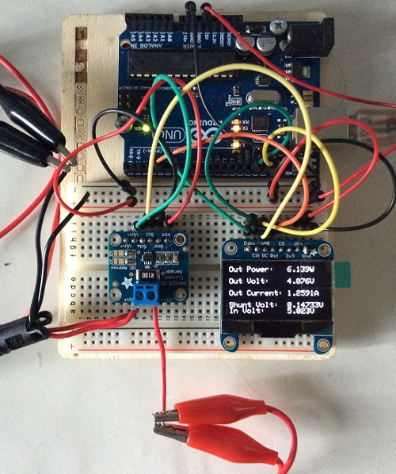
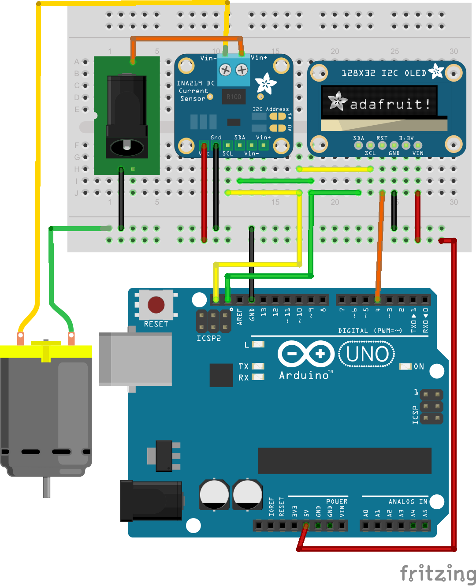

power_measure_tool
==================

An Arduino setup to measure the voltage and current of a load.

This logical schematic differs slightly from the physical curcuit layout. The motor here acts as the load. The barrel jack powers the load independently from the Arduino (USB) power supply.

##Parts List:
1. Arduino Uno R3
2. Adafruit INA219 High Side DC Current Sensor Breakout
3. Adafruit 1.3" 128x64 OLED set to I2C

##Results output:
The results are dynamically written to the Arduino serial port at baud rate 115200. A sample result is:  
1.987 5.080 0.3911 0.03805 5.118

1. Output power: 1.987 watts
2. Output voltage: 5.080 volts
3. Output current: 0.3911 amperes
4. Shunt voltage: 0.03805 volts
5. Input voltage: 5.118 volts (= output voltage + shunt voltage)

